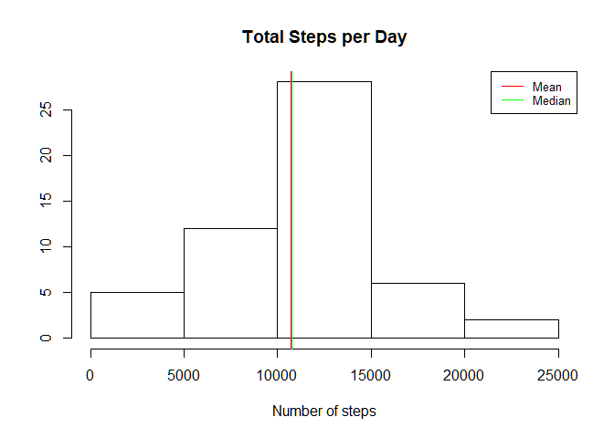
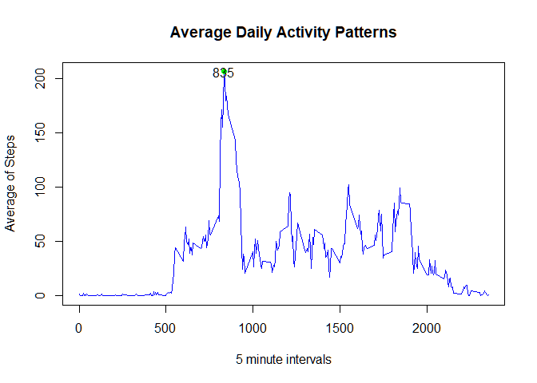
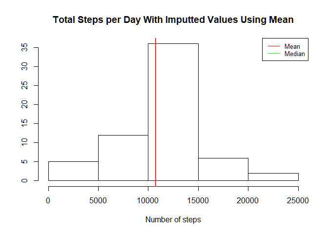
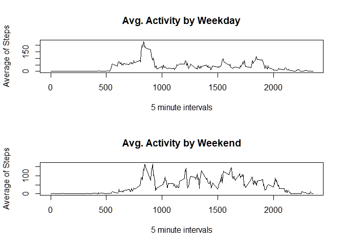

```r
library(ggplot2)
```

```
## Warning: package 'ggplot2' was built under R version 3.6.3
```

```r
library(dplyr)
```

```
## Warning: package 'dplyr' was built under R version 3.6.3
```

```
## 
## Attaching package: 'dplyr'
```

```
## The following objects are masked from 'package:stats':
## 
##     filter, lag
```

```
## The following objects are masked from 'package:base':
## 
##     intersect, setdiff, setequal, union
```

## Decompressing Data

To start the analysis, and since data has already been included in the current 
repository, but it's compressed in a zip file, we'll start by decompressing the 
file.


```r
file_name <- "activity.zip"
dest_file <- file.path("./", file_name)
unzip(dest_file)
```


## Loading and preprocessing the data
The next step is to load the data from the uncompressed file.


```r
act_data <- read.csv("activity.csv")
```

## Summary on the data

### First let's take a look at the dimensions of the data, see the first five
rows and a summary:

```r
dim(act_data)
```

```
## [1] 17568     3
```

```r
head(act_data)
```

```
##   steps       date interval
## 1    NA 2012-10-01        0
## 2    NA 2012-10-01        5
## 3    NA 2012-10-01       10
## 4    NA 2012-10-01       15
## 5    NA 2012-10-01       20
## 6    NA 2012-10-01       25
```

### Summary

```r
summary(act_data)
```

```
##      steps                date          interval     
##  Min.   :  0.00   2012-10-01:  288   Min.   :   0.0  
##  1st Qu.:  0.00   2012-10-02:  288   1st Qu.: 588.8  
##  Median :  0.00   2012-10-03:  288   Median :1177.5  
##  Mean   : 37.38   2012-10-04:  288   Mean   :1177.5  
##  3rd Qu.: 12.00   2012-10-05:  288   3rd Qu.:1766.2  
##  Max.   :806.00   2012-10-06:  288   Max.   :2355.0  
##  NA's   :2304     (Other)   :15840
```

As we can observe there are 2304 NA values or missing values in our step column
data. Let's see how much percentage of our data is missing:


```r
mean(is.na(act_data$steps))
```

```
## [1] 0.1311475
```
Around 13% of step data is missing, though given the data is measured on 
intervals of every 5 seconds, that may not make a huge impact on our analysis 
and later we can try to fix this. For now, we'll remove the missing data for 
our dataset from a copy of the loaded data.


```r
act_data_no_nas <- act_data[complete.cases(act_data), ]
head(act_data_no_nas)
```

```
##     steps       date interval
## 289     0 2012-10-02        0
## 290     0 2012-10-02        5
## 291     0 2012-10-02       10
## 292     0 2012-10-02       15
## 293     0 2012-10-02       20
## 294     0 2012-10-02       25
```

## What is mean total number of steps taken per day?

Now, let's take a look at some of the descritive analysis we can get from the
data, starting with the number of steps taken per day:


```r
steps_per_day <- aggregate(
    x = act_data_no_nas$steps,
    by = list(day = as.factor(act_data_no_nas$date)),
    FUN = sum
)
```


```r
steps_mean = mean(steps_per_day$x)
steps_median = median(steps_per_day$x)

hist(
    steps_per_day$x,
    main = "Total Steps per Day",
    ylab = "",
    xlab = "Number of steps"
)

abline(v = steps_mean, col = "red", lwd = 2)
abline (v = steps_median, col = "green")

legend(
    "topright",
    legend = c("Mean", "Median"),
    col = c("red", "green"),
    lty = 1,
    cex = 0.8
)
```

<!-- -->
Here we can see that the mean and the median have a negatively skewed tendency.

## What is the average daily activity pattern?


```r
act_data_no_nas$date <- as.Date(act_data_no_nas$date)
steps_by_interval <-
    aggregate(act_data_no_nas$steps ~ act_data_no_nas$interval, FUN = mean)
```


```r
plot(
    steps_by_interval$`act_data_no_nas$interval`,
    steps_by_interval$`act_data_no_nas$steps`,
    type = "l",
    ylab = "Average of Steps",
    xlab = "5 minute intervals",
    main = "Average Daily Activity Patterns",
    col = "blue"
)

max_interval <- which.max(steps_by_interval$`act_data_no_nas$steps`)
max_x <- steps_by_interval$`act_data_no_nas$interval`[max_interval]
max_y <- max(steps_by_interval$`act_data_no_nas$steps`)
             
points(max_x,max_y,col="green", pch=16)
text(max_x, max_y,labels = max_x)
```

<!-- -->

Here we see that the time with the most activity or number of steps on average
per day is 835, that 8:35am.


## Imputing missing values

Note that there are a number of days/intervals where there are missing values.
The presence of missing days may introduce bias into some calculations or
summaries of the data, so we'll be imputing for values for those missing data:

The total number of missing values is 2304.

To solve this, we can try imputing missing values by using an easy and fast
strategy like, using the mean value of the steps by day we calculated above:


```r
act_data_imputted <- act_data

for (i in 1:length(act_data_imputted$steps)) {
    if (is.na(act_data_imputted$steps[i])) {
        current_interval <- act_data_imputted$interval[i]
        replace_interval <-
            which(steps_by_interval$`act_data_no_nas$interval` == current_interval)
        
        act_data_imputted$steps[i] <-
            steps_by_interval$`act_data_no_nas$steps`[replace_interval]
    }
}
```

Let's now check for the difference plotting the new dataset:


```r
imputted_steps_per_day <- aggregate(
    x = act_data_imputted$steps,
    by = list(day = as.factor(act_data_imputted$date)),
    FUN = sum
)
```


```r
imputted_steps_mean = mean(imputted_steps_per_day$x)
imputted_steps_median = median(imputted_steps_per_day$x)

hist(
    imputted_steps_per_day$x,
    main = "Total Steps per Day With Imputted Values Using Mean",
    ylab = "",
    xlab = "Number of steps"
)

abline(v = imputted_steps_mean, col = "red", lwd = 2)
abline (v = imputted_steps_median, col = "green")

legend(
    "topright",
    legend = c("Mean", "Median"),
    col = c("red", "green"),
    lty = 1,
    cex = 0.8
)
```

<!-- -->
Here we may have a similar distribution, which didn't make a huge impact on the 
data.

## Are there differences in activity patterns between weekdays and weekends?

Using the  filled-in missing values for this part, we're going to crate a new
column in the dataset identifying if the activity was performed on a weekday
or the weekend:


```r
wend <- c("Sat", "Sun")

act_data_imputted <- 
    mutate(act_data_imputted,
       weekday = as.factor(ifelse(
           weekdays(as.Date(act_data_imputted$date), abbreviate = T) %in% wend,
           yes = "weekend",
           no = "weekday"
       )))

head(act_data_imputted)
```

```
##       steps       date interval weekday
## 1 1.7169811 2012-10-01        0 weekday
## 2 0.3396226 2012-10-01        5 weekday
## 3 0.1320755 2012-10-01       10 weekday
## 4 0.1509434 2012-10-01       15 weekday
## 5 0.0754717 2012-10-01       20 weekday
## 6 2.0943396 2012-10-01       25 weekday
```

First, let's split data for weekday and weekend.


```r
splitted <- split(act_data_imputted, act_data_imputted$weekday)
```


```r
i_weekday_by_interval <-
    aggregate(splitted$weekday$steps ~ splitted$weekday$interval, FUN = mean)

i_weekend_by_interval <-
    aggregate(splitted$weekend$steps ~ splitted$weekend$interval, FUN = mean)
```

Now let's plot data:


```r
par(mfrow=c(2,1))

plot(
    i_weekday_by_interval$`splitted$weekday$interval`,
    i_weekday_by_interval$`splitted$weekday$steps`,
    type = "l",
    ylab = "Average of Steps",
    xlab = "5 minute intervals",
    main = "Avg. Activity by Weekday"
)

plot(
    i_weekend_by_interval$`splitted$weekend$interval`,
    i_weekend_by_interval$`splitted$weekend$steps`,
    type = "l",
    ylab = "Average of Steps",
    xlab = "5 minute intervals",
    main = "Avg. Activity by Weekend"
)
```

<!-- -->
Here, it seems subject is more active during weekends than weekdays, especially
after 10am.
